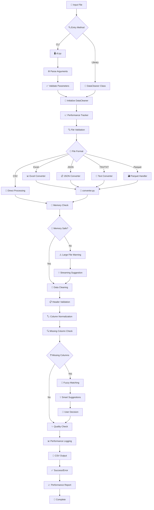
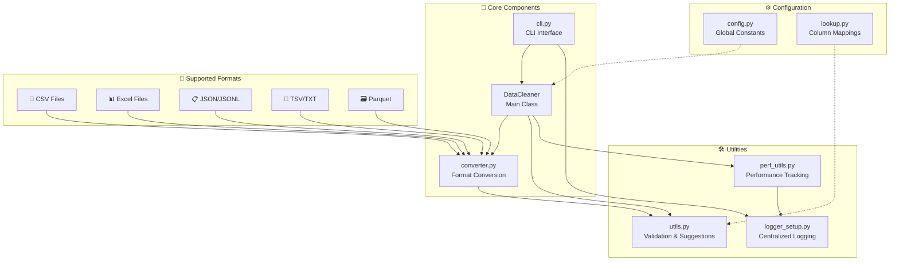
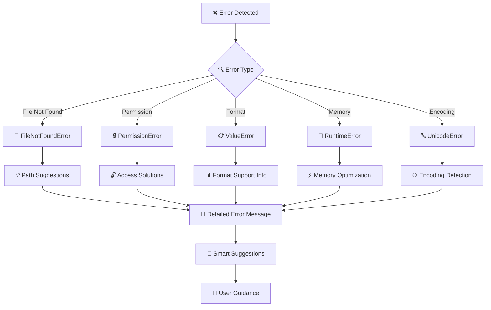

# 🔄 Data Cleaner - System Architecture & Flow

## 📊 Main Processing Flow

## 🏗️ Component Architecture

## 🔄 Error Handling Flow

## 📈 Performance Monitoring

```mermaid
sequenceDiagram
    participant U as User
    participant DC as DataCleaner
    participant PT as PerformanceTracker
    participant MM as MemoryMonitor
    
    U->>DC: Process File
    DC->>PT: Start Tracking
    PT->>MM: Begin Memory Monitor
    
    loop Processing Steps
        DC->>PT: Log Step Start
        DC->>DC: Execute Operation
        MM->>PT: Memory Usage Update
        DC->>PT: Log Step Complete
    end
    
    PT->>MM: Stop Monitoring
    PT->>DC: Generate Report
    DC->>U: Results + Performance Summary
```

## 🎯 Usage Patterns

### CLI Usage Flow

### Library Usage Flow

---

## 📚 How to Use This Diagram

1. **Copy the markdown content** above
2. **Paste it into your README.md** in the appropriate section
3. **GitHub will automatically render** the Mermaid diagrams
4. **Customize colors/styling** by modifying the mermaid syntax if needed

## 🎨 Diagram Features

- ✅ **GitHub Compatible**: Uses Mermaid syntax supported by GitHub
- 🎯 **Clear Visual Hierarchy**: Different shapes and colors for different components
- 📱 **Mobile Friendly**: Scales well on different screen sizes
- 🔄 **Interactive**: Hover effects and clickable elements (when supported)
- 📊 **Comprehensive**: Shows main flow, architecture, error handling, and performance monitoring

## 💡 Pro Tips for GitHub

- Mermaid diagrams render automatically in GitHub README files
- No additional setup or external tools required
- Diagrams are searchable and accessible
- They automatically adapt to GitHub's light/dark themes
- Can be easily updated by editing the markdown source